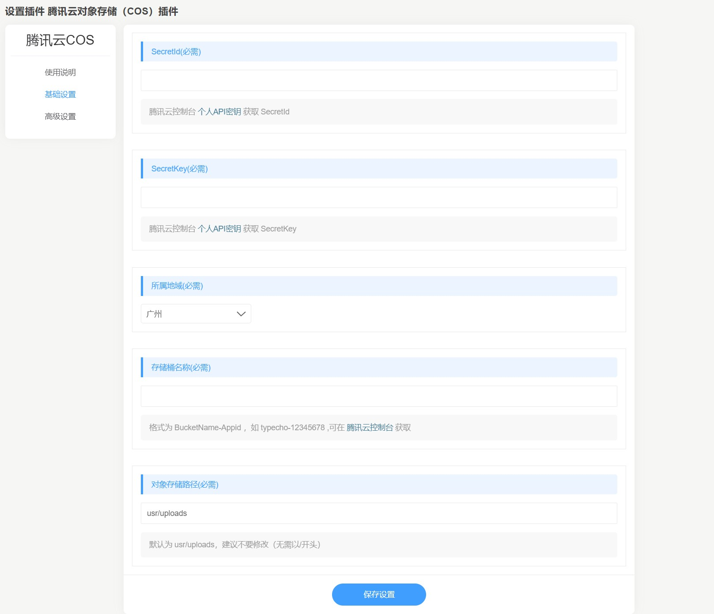
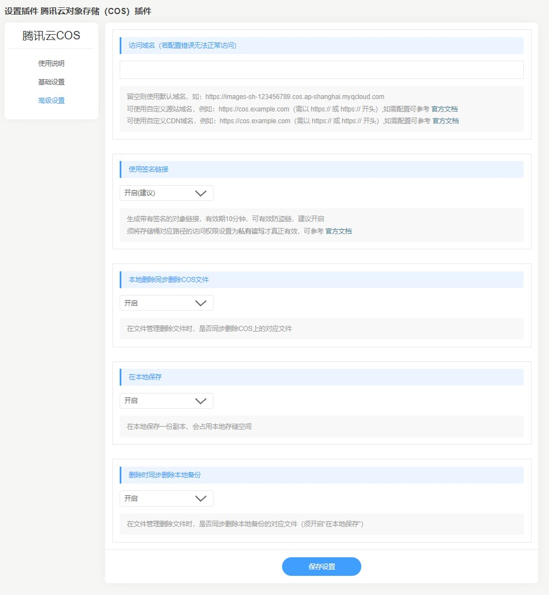

# 腾讯云对象存储插件（Typecho版）

## 0.版本依赖

- 依赖 PHP 5.6+ 环境

- 已测试Typecho版本：1.2.0

## 1.插件介绍
> Typecho COS插件是由lxyxinyuli基于苏苏开发的[TypechoCosPlugin](https://github.com/cnhongv/typecho-cos-plugin)进行二次开发，提供给Typecho用户使用的插件。实现网站静态资源存储到腾讯云COS，有效降低本地存储负载，提升用户体验。二次开发中同步增加删除文件逻辑，去掉原插件备份功能按钮，更改请求头user_agent值。

| 标题       | 名称                                                         |
| ---------- | ------------------------------------------------------------ |
| 中文名称   | 腾讯云对象存储（COS）插件                                    |
| 英文名称   | Typecho-Cos-Plugin                                           |
| 最新版本   | 1.0.2 (2022.10.24)                                           |
| 适用平台   | [Typecho](https://typecho.org/)                              |
| 适用产品   | [腾讯云对象存储（COS）](https://cloud.tencent.com/product/cos) |
| GitHub项目 | [tencentcloud-typecho-plugin-cos](https://github.com/Tencent-Cloud-Plugins/tencentcloud-typecho-plugin-cos) |

## 2.功能特性

- 支持验证桶名是否有效
- 上传图片/附件到COS存储桶内，可配置是否保留本地备份
- 修改已上传的图片/附件，COS存储桶内附件实现同步修改
- 删除已上传的图片/附件时，支持删除/保留cos存储桶中对应文件（实现此功能用本项目中的/var/Widget/Upload.php覆盖typecho的源码的同路径同名文件，不进行此操作，只合并TypechoCosPlugin/文件夹下代码可实现上传和修改功能）

## 3.安装指引

### 3.1.部署方式：通过GitHub部署安装

> 1. `git clone https://github.com/Tencent-Cloud-Plugins/tencentcloud-typecho-plugin-cos`
> 2. 复制TypechoCosPlugin文件夹到Typecho安装路径/usr/plugins/内
> 3. 复制/var/Widget/Upload.php到Typecho博客源码安装路径/var/Widget/内,覆盖掉博客源码中的/var/Widget/Upload.php

## 4.使用指引

### 4.1.界面功能介绍

> 上图主要是配置COS插件的腾讯云基本参数，包括secretId、secretKey、所属地域、存储桶名称、对象存储路径

> 上图是额外配置，自定义访问域名、使用签名后的链接、本地删除同步删除COS文件、在本地保存、删除时同步删除本地备份

**如果需更新存储桶设置，需要先在插件界面禁用本插件，再重新激活本插件后进行设置，才能将新配置写入库中**

### 4.2.名词解释

- **SecretId**：用于标识 API 调用者身份，可以简单类比为用户名。可从[API密钥管理](https://console.cloud.tencent.com/cam/capi)获取。
- **SecretKey**：用于验证 API 调用者的身份，可以简单类比为密码。可从[API密钥管理](https://console.cloud.tencent.com/cam/capi)获取。
- **所属地域**：在腾讯云服务器所在地域。详情参考[腾讯云文档](https://cloud.tencent.com/document/product/436/6224)
- **存储桶名称**：COS服务中存储桶的名称。详情参考[腾讯云文档](https://cloud.tencent.com/document/product/436/13312)
- **对象存储路径**：文件存储的前缀，为更接近Typecho默认设置，本插件默认为`usr/uploads`，可根据实际情况自行修改
- **访问域名**：存储桶的域名。详情参考[腾讯云文档](https://cloud.tencent.com/document/product/436/6224)
- **在本地保存**：开启后，静态文件同步到腾讯云COS后在本地保存一份副本，会占用本地存储空间。
- **本地删除同步删除COS文件**：开启后，在文件管理删除文件时，会同步删除COS上的对应文件。
- **删除时同步删除本地备份**：开启后，在文件管理删除文件时，会同步删除本地备份的对应文件（须开启**在本地保存**）。

## 5.获取入口

| 插件入口 | 链接                                                         |
| -------- | ------------------------------------------------------------ |
| GitHub   | [link](https://github.com/Tencent-Cloud-Plugins/tencentcloud-typecho-plugin-cos) |

## 6.FAQ

### 为什么激活插件后功能没有生效?
> 1. 腾讯云的COS服务是否正常开启，是否欠费；  
> 2. 首先确认配置参数SecretId、SecretKey、所属地域和存储桶名称是否都正确；
> 3. 到腾讯云的COS服务界面查看附件是否有上传；
> 4. 是否有开启防盗链功能；

## 7.版本迭代记录
### 2022.10.24 TypechoCosPlugin v1.0.2

- 更改susu开发插件[TypechoCosPlugin](https://github.com/cnhongv/typecho-cos-plugin)，支持本地删除同步删除COS文件、删除时同步删除本地备份
- 去除备份相关按钮
- 更改请求头user_agent值

## 8.致谢

- 该插件使用了腾讯云COS官方SDK [COS-PHP-SDK-V5](https://github.com/tencentyun/cos-php-sdk-v5)
- 该插件基于Typecho 插件 [TypechoCosPlugin](https://github.com/cnhongv/typecho-cos-plugin)二次开发，特此对开发者susu进行致谢。

本项目由个人建设和维护，如有问题可以在Issues提交。